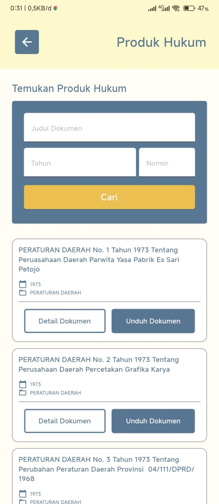

# JDIH Provinsi Lampung

## Overview

Aplikasi ini adalah aplikasi JDIH Provinsi Lampung yang dibangun menggunakan framework Flutter. Aplikasi ini dibangun untuk memenuhi Projek Kuliah Praktik.

## Tech Stack

- [Flutter](https://flutter.dev/)
- [Dart](https://dart.dev/)
- [NodeJS](https://nodejs.org/en/)
- [ExpressJS](https://expressjs.com/)
- [Prisma](https://www.prisma.io/)
- [MySQL](https://www.mysql.com/)

## Features

- [x] Produk Hukum
- [x] Monografi Hukum
- [x] Berita
- [x] Artikel Hukum
- [x] Galeri
- [x] Putusan

## Todo

- [x] UI/UX Design
- [x] Implementasi Design
- [x] Implementasi API

## Screenshots

| Home | Produk Hukum | Monografi Hukum |
|:-:|:-:|:-:|
|  |  |  |

| Berita | Galeri | Produk Hukum |
|:-:|:-:|:-:|
|  |  |  |

## Backend

[Click Here](https://github.com/maybeenang/JDIH-prov-lampung-backend)

